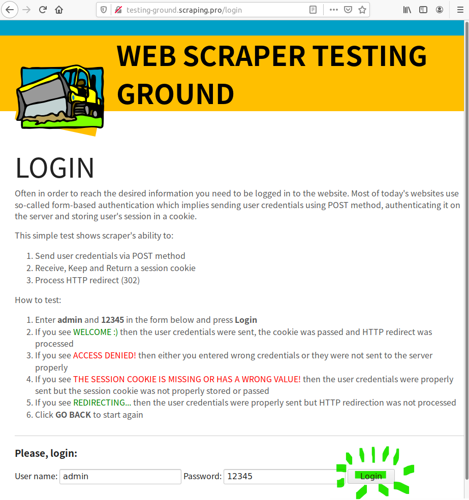
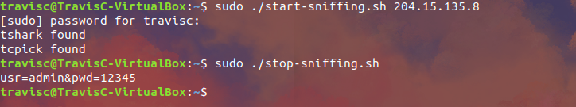

# README: http-password-sniffer
A simple bash script to help with sniffing passwords sent over insecure http post requests.
This attack employs twireshark, hence it can only sniff for passwords that are sent over the same network.

## User Guide
### Demo attack
Website: http://testing-ground.scraping.pro/login (ip-address: 204.15.135.8)

Usually you wait for users to access the website and input their user name and passwords (i.e. sniffing other user's password), however just to test that the script works as intended, the following is a local simulation.

1. Download this repository
2. Change permission for both the scripts
>`chmod a+x start-sniffing.sh`

>`chmod a+x stop-sniffing.sh`
3. Run start-sniffing script with root privilege by passing in the ip address of the http website you intend to sniff: 
>`sudo ./start-sniffing.sh 204.15.135.8`
4. Visit the website that you passed into the script
5. Key in user name & password, press login
>`e.g. user name: admin | password: 12345`

6. Run stop-sniffing script
>`sudo ./stop-sniffing.sh`
7. Done! You should see the user name & password inputed earlier being output to the terminal.

